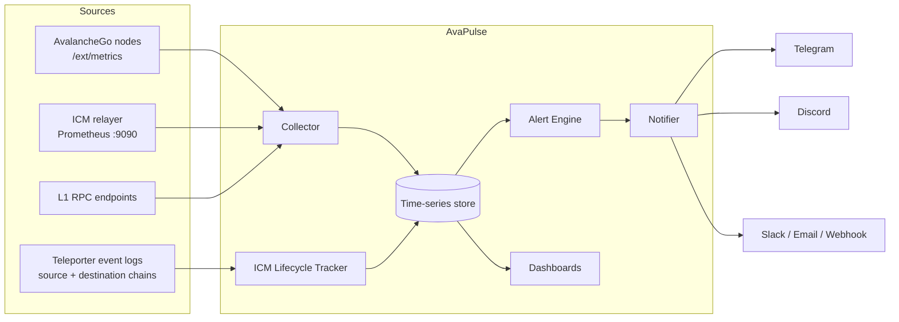

# Architecture

AvaPulse is a small number of composable services, shipped together via `docker-compose`, designed so the self-hosted path is first-class and a hosted version is the same stack multi-tenanted.

## System overview



## Components

### Collector
Scrapes and normalizes three source types on a configurable interval:

- **Node metrics** — AvalancheGo's Prometheus endpoint (`/ext/metrics`): uptime, peers, DB health, consensus metrics per chain.
- **Relayer metrics** — the icm-services relayer's Prometheus endpoint: messages received/delivered per source→destination pair, error counters.
- **RPC health probes** — `eth_blockNumber` / `eth_chainId` round-trips per L1: latency, block progression, endpoint availability.

### ICM Lifecycle Tracker
The piece no generic monitoring stack has. Subscribes to Teleporter contract event logs on configured source and destination chains and correlates them by `messageID`:

```
SendCrossChainMessage ──▶ ReceiveCrossChainMessage ──▶ MessageExecuted / MessageExecutionFailed ──▶ Receipt
```

Each tracked message carries timestamps per stage, so the tracker can answer: *which messages are past their expected delivery window right now?* — the primitive behind stuck-message and stalled-relayer alerts. This engine is derived from the correlation core validated in [ICM Trace](https://icm-trace.vercel.app/).

### Alert Engine
Evaluates rules against the store on a fixed tick. Rules are declarative YAML (thresholds, windows, severities) with the Avalanche-native rule set shipped as defaults — see [ALERT-RULES.md](ALERT-RULES.md). Deduplication and cooldowns prevent alert storms; every alert has a firing and a recovery notification.

### Notifier
Fan-out to Telegram, Discord, Slack, email, and generic webhooks. Channel routing is per-rule-severity (e.g. critical → Telegram + Discord, warning → Discord only).

### Dashboards
Prebuilt views served by a lightweight web UI: node health, per-L1 chain health, and the cross-chain message-flow board (live message lifecycle states per chain pair).

## Storage

SQLite for single-operator self-hosting (zero-dependency default), Postgres + TimescaleDB behind a compose profile for larger deployments and the hosted version. Metrics are downsampled after 7 days; message lifecycle records are kept raw for 30 days.

## Tech stack

- **TypeScript / Node.js** — collector, tracker, alert engine, notifier
- **viem** — RPC probes and Teleporter event log subscriptions
- **SQLite / Postgres** — storage
- **React** — dashboard UI
- **docker-compose** — one-command self-hosting

## Configuration sketch

```yaml
# avapulse.yaml
chains:
  - name: my-l1
    rpc: https://my-l1.example.com/rpc
    node_metrics: http://10.0.0.5:9650/ext/metrics
  - name: c-chain
    rpc: https://api.avax.network/ext/bc/C/rpc

relayers:
  - name: main-relayer
    metrics: http://10.0.0.6:9090/metrics
    gas_wallets:
      - chain: my-l1
        address: "0xRelayerWallet"
        min_balance: "0.5 AVAX"

icm:
  pairs:
    - from: c-chain
      to: my-l1
      max_delivery_seconds: 120

notify:
  telegram: { bot_token: $TG_TOKEN, chat_id: $TG_CHAT }
  discord:  { webhook: $DISCORD_WEBHOOK }
```

## Design principles

1. **Alerting-first** — dashboards support the alerts, not the other way round. The product is "you find out first," not "another place to look."
2. **Semantic over infrastructural** — every shipped rule encodes Avalanche/ICM domain knowledge a generic Alertmanager rule cannot express.
3. **Self-hosted is first-class** — the open-source compose stack is the product; the hosted tier is a convenience, not a gate.
